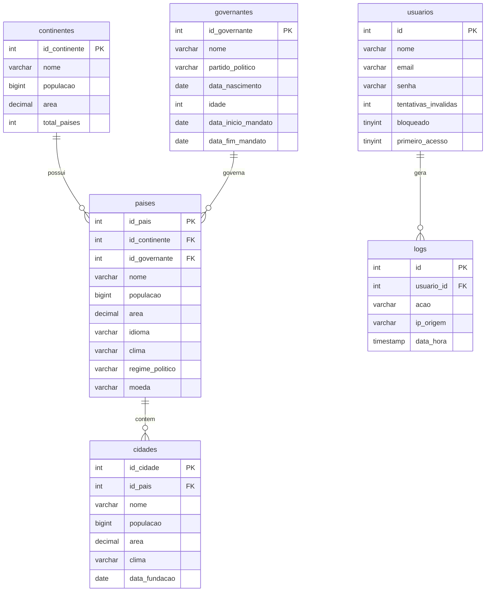

# CRUD Mundo

Sistema web para gerenciamento de dados geográficos mundiais: continentes, países, cidades e governantes, com autenticação de usuários e registro de logs.


---

## Sobre o projeto

O CRUD Mundo é uma aplicação web destinada ao gerenciamento de dados geográficos mundiais. Através dela é possível cadastrar, consultar, atualizar e excluir continentes, países, cidades e governantes.

O acesso é restrito a usuários autenticados. O sistema controla tentativas de login inválidas (bloqueando a conta após três erros), exige a troca de senha no primeiro acesso e registra as ações principais em logs, com data, hora e IP de origem.

## Funcionalidades

- Autenticação de usuários (login e logout)
- Bloqueio automático de conta após 3 tentativas de senha incorretas
- Troca obrigatória de senha no primeiro acesso
- Alteração de senha pelo próprio usuário, com confirmação da senha atual
- CRUD completo de continentes, países, cidades e governantes
- Registro de logs das ações realizadas no sistema

## Tecnologias utilizadas

- PHP
- MySQL
- HTML / CSS
- JavaScript
- Git e GitHub

## Modelo do banco de dados

O banco de dados é composto por seis tabelas, relacionadas conforme o diagrama abaixo:



## Estrutura do projeto

```text
CrudMundo/
├── index.php              # Página inicial
├── login.php              # Autenticação
├── logout.php             # Encerramento da sessão
├── trocar_senha.php       # Troca obrigatória no primeiro acesso
├── alterar_senha.php      # Alteração voluntária de senha
├── .env.example           # Modelo das variáveis de ambiente
├── continentes/           # CRUD de continentes
├── paises/                # CRUD de países
├── cidades/               # CRUD de cidades
├── governantes/           # CRUD de governantes
├── css/                   # Folhas de estilo
├── js/                    # Scripts
├── includes/              # Conexão com o banco e autenticação
└── database/              # Script SQL do banco de dados
```

## Como executar

**Requisitos:** PHP, MySQL e um servidor local como XAMPP ou WampServer.

1. Baixe ou clone o repositório
2. Copie a pasta `CrudMundo` para a pasta do servidor local (`htdocs`, no caso do XAMPP)
3. Importe o arquivo `database/bd_mundo.sql` pelo phpMyAdmin
4. Crie o arquivo `.env` na raiz do projeto com base no `.env.example`
5. Inicie os serviços Apache e MySQL
6. Acesse `http://localhost/CrudMundo` no navegador

> **Nota:** o arquivo `.env` não é versionado, pois contém os dados de conexão
> com o banco. Cada ambiente de execução deve ter o seu próprio.

## Autor

Desenvolvido por **Gabriel Henrique da Silva** — Desenvolvimento de Sistemas, ETEC Profº Ilxa Nascimento Pinntus.
