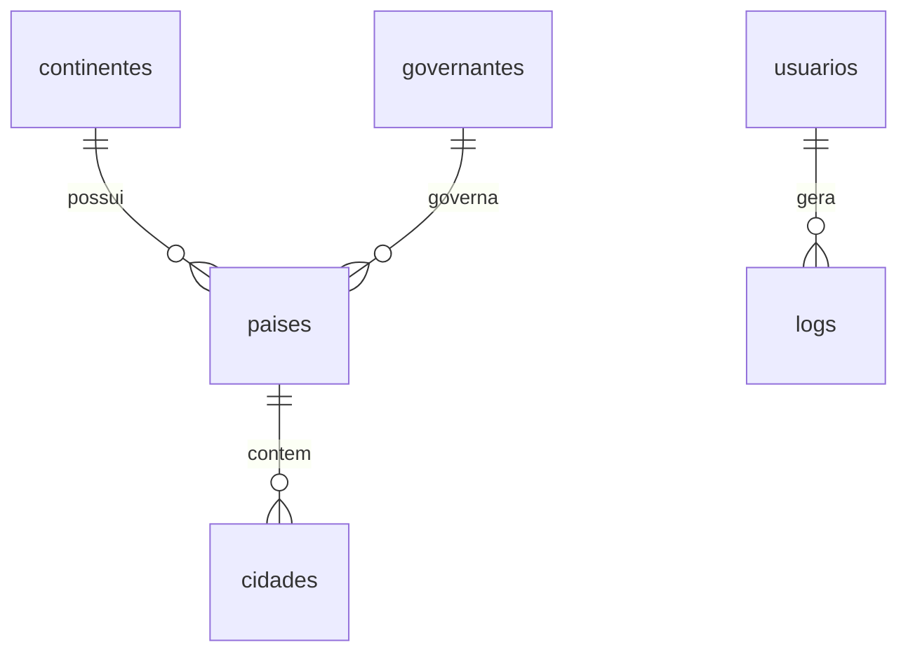

# 🌍 CRUD Mundo

**Sistema web para gerenciamento de dados geográficos mundiais**

---

## 📖 Sobre o projeto

O CRUD Mundo é uma aplicação web destinada ao gerenciamento de dados geográficos mundiais, permitindo o cadastro, a consulta, a atualização e a exclusão de **continentes**, **países**, **cidades** e **governantes**.

O sistema conta com autenticação de usuários, bloqueio de conta após tentativas inválidas de login, troca obrigatória de senha no primeiro acesso e registro de logs com data, hora e IP de origem.

## ✨ Funcionalidades

- 🔐 Login e logout de usuários
- 🚫 Bloqueio de conta após 3 tentativas de senha incorretas
- 🔑 Troca obrigatória de senha no primeiro acesso
- 👤 Alteração voluntária de senha com validação da senha atual
- 🌐 CRUD completo de continentes
- 🏳️ CRUD completo de países
- 🏙️ CRUD completo de cidades
- 👑 CRUD completo de governantes
- 📋 Registro de logs de ações do usuário

## 🗄️ Modelo do banco de dados

## 🛠️ Tecnologias utilizadas

- PHP
- MySQL
- HTML
- CSS
- JavaScript
- Git / GitHub

## 📁 Estrutura do projeto

| Pasta / Arquivo | Descrição |
|---|---|
| `index.php` | Página inicial do sistema |
| `login.php` / `logout.php` | Autenticação do usuário |
| `trocar_senha.php` | Troca obrigatória de senha no primeiro acesso |
| `alterar_senha.php` | Alteração voluntária de senha |
| `continentes/` | CRUD de continentes |
| `paises/` | CRUD de países |
| `cidades/` | CRUD de cidades |
| `governantes/` | CRUD de governantes |
| `css/` | Folhas de estilo |
| `js/` | Scripts JavaScript |
| `includes/` | Autenticação e conexão com o banco |
| `database/` | Script SQL do banco de dados |
| `.env.example` | Modelo das variáveis de ambiente |

## ⚙️ Requisitos

- PHP
- MySQL
- Servidor local (XAMPP, WampServer ou similar)
- Navegador

## 🚀 Como executar

1. Clone o repositório ou baixe o ZIP
2. Copie a pasta `CrudMundo` para a pasta do servidor local (ex.: `htdocs` no XAMPP)
3. Crie o arquivo `.env` na raiz do projeto com base no `.env.example`
4. Inicie os serviços Apache e MySQL
5. Importe o arquivo `database/bd_mundo.sql` pelo phpMyAdmin
6. Acesse `http://localhost/CrudMundo` no navegador

---

**👤 Autor**

Seu Nome Completo — Desenvolvimento de Sistemas | ETEC ETECOS

